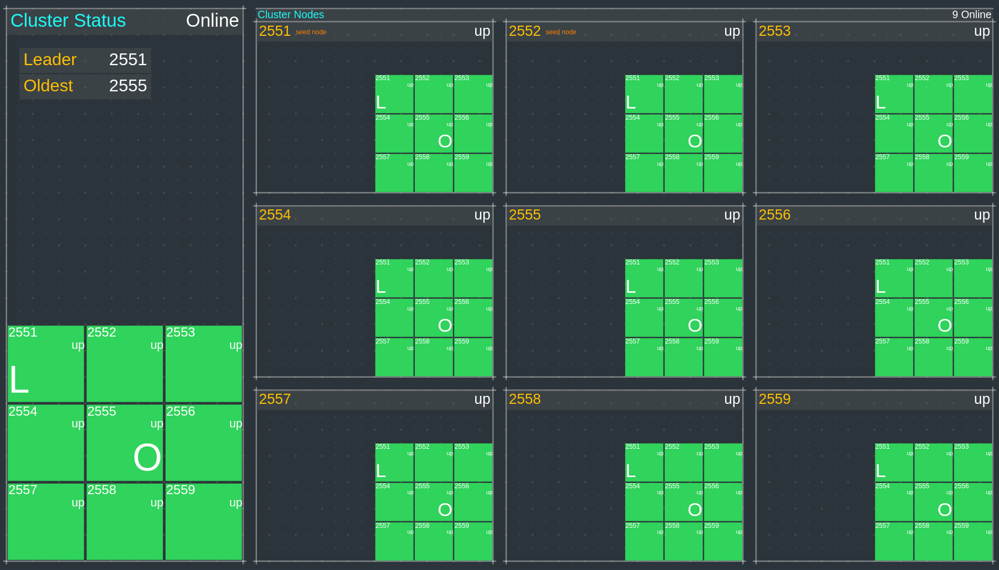
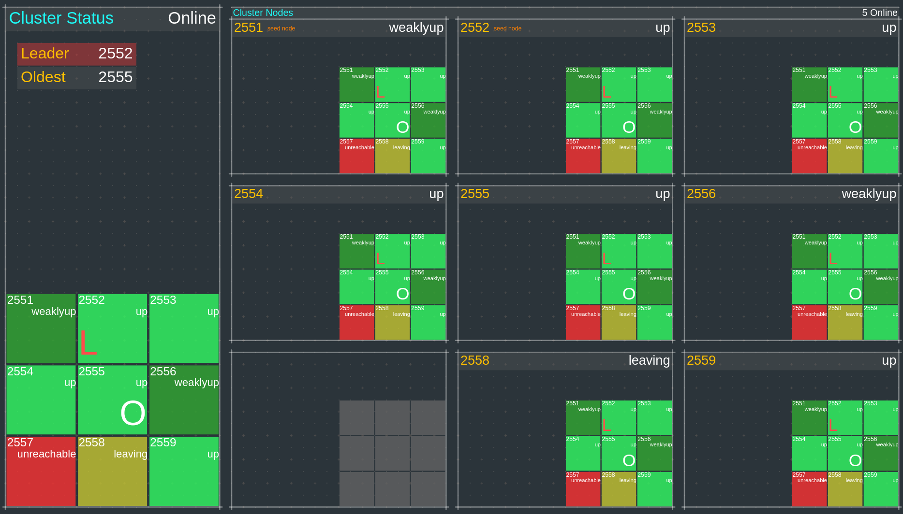
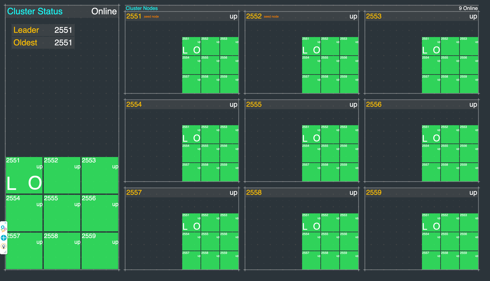
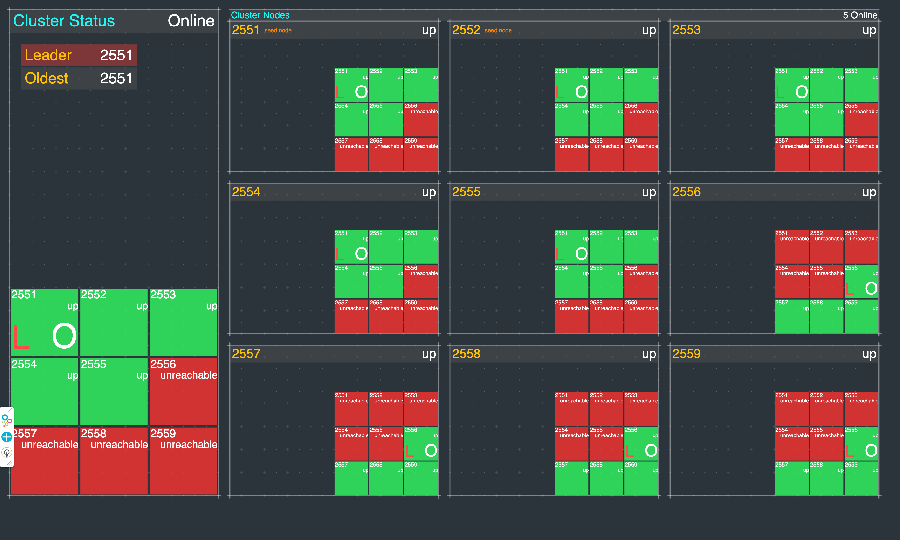
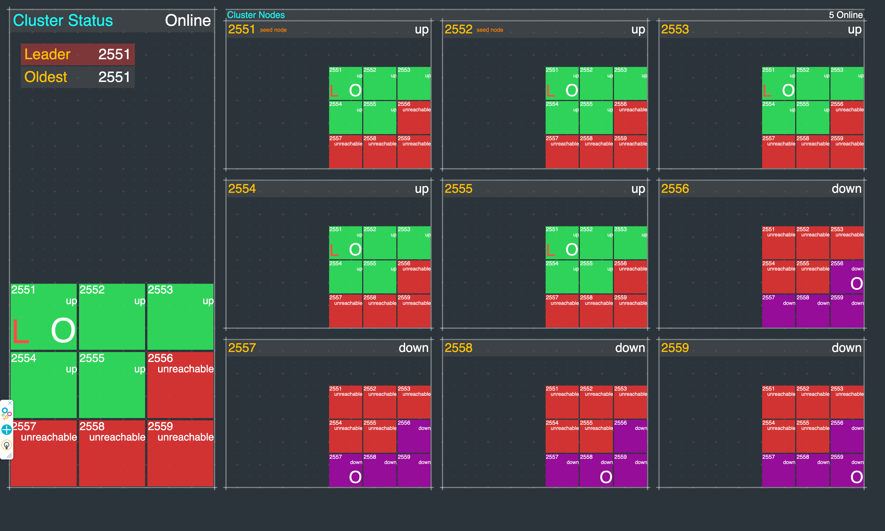
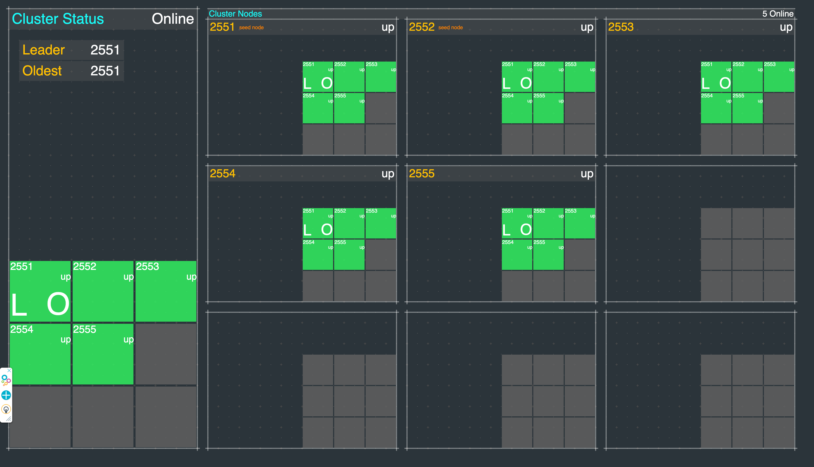

# Akka Typed Java Cluster Example

This is a Java, Maven, Akka project that demonstrates how to setup a basic
[Akka Cluster](https://doc.akka.io/docs/akka/current/typed/index-cluster.html).

This project is one in a series of projects that starts with a simple Akka Cluster project and progressively builds up to examples of event sourcing and command query responsibility segregation.

The project series is composed of the following GitHub repos:

* [akka-typed-java-cluster](https://github.com/mckeeh3/akka-typed-java-cluster) (this project)
* [akka-typed-java-cluster-aware](https://github.com/mckeeh3/akka-typed-java-cluster-aware)
* [akka-typed-java-cluster-singleton](https://github.com/mckeeh3/akka-typed-java-cluster-singleton)
* [akka-typed-java-cluster-sharding](https://github.com/mckeeh3/akka-typed-java-cluster-sharding)
* [woe-sim](https://github.com/mckeeh3/woe-sim) an example of
[Akka Persistence](https://doc.akka.io/docs/akka/current/typed/index-persistence.html)
* [woe-twin](https://github.com/mckeeh3/woe-twin) an example of
[Akka Persistence](https://doc.akka.io/docs/akka/current/typed/index-persistence.html)
 and
[Akka Projections](https://doc.akka.io/docs/akka-projection/current/)

Each project can be cloned, built, and runs independently of the other projects.

- [Akka Typed Java Cluster Example](#akka-typed-java-cluster-example)
  - [About Akka Clustering](#about-akka-clustering)
  - [The ClusterListenerActor Actor](#the-clusterlisteneractor-actor)
  - [How it works](#how-it-works)
  - [Installation](#installation)
  - [Run a cluster (Mac, Linux, Cygwin)](#run-a-cluster-mac-linux-cygwin)
  - [The Cluster Dashboard](#the-cluster-dashboard)
  - [How the Cluster Dashboard Works](#how-the-cluster-dashboard-works)
  - [About the Akka Split Brain Resolver](#about-the-akka-split-brain-resolver)
  - [Manually Trigger a Network Partition](#manually-trigger-a-network-partition)

## About Akka Clustering

According to the [Akka documentation](https://doc.akka.io/docs/akka/current/common/cluster.html),
"*Akka Cluster provides a fault-tolerant decentralized peer-to-peer based cluster membership service with no single point of failure or single point of bottleneck. It does this using gossip protocols and an automatic failure detector.*

*Akka cluster allows for building distributed applications, where one application or service spans multiple nodes.*"

The above paragraphs from the Akka documentation are packed with a lot of concepts that initially may be hard to wrap your head around. Consider some of the terms that were thrown out in just two sentences, terms like "fault-tolerant," "decentralized," "peer-to-peer" and "no single point of failure." The last sentence almost casually states "*where one application or service spans multiple nodes*." Wait; what? How does an application or service span multiple nodes?

The answer is that Akka provides an abstraction layer that is composed of actors interacting with each other in an actor system. Akka is an implementation of the actor model.
The actor model "*[(Wikipedia)](https://en.wikipedia.org/wiki/Actor_model) treats "actors" as the universal primitives of concurrent computation. In response to a message that it receives, an actor can: make local decisions, create more actors, send more messages, and determine how to respond to the next message received. Actors may modify their own private state, but can only affect each other through messages (avoiding the need for any locks).*"

Akka actors communicate with each other via asynchronous messages. Akka actors systems run on Java Virtual Machines, and with Akka clusters, a single actor system may logically span multiple networked JVMs. This networked actor system abstraction layer makes it possible for actors to transparently communicate with each across a cluster of nodes. One way to think of this is that from the perspective of actors, they live in an actor system, the fact that the actor system is running on one or more nodes is, for the most part, hidden within the abstraction layer.

## The ClusterListenerActor Actor

Akka actors are implemented in Java or Scala. You create actors as Java or Scala classes. There are two ways to implement actors, either
[typed](https://doc.akka.io/docs/akka/current/typed/actors.html)
or
[classic](https://doc.akka.io/docs/akka/current/actors.html).
Typed actors are used in this Akka Java cluster example project series.

The Akka documentation section about
[Actors](https://doc.akka.io/docs/akka/current/general/actors.html)
is a good starting point for those of you that are interested in diving into the details of how actors work and how they are implemented.

The first actor we will look at is named ClusterListenerActor. This actor is set up to receive messages about cluster events.  As nodes join and leave the cluster, this actor receives messages about these events. Theses received messages are then written to a logger.

The ClusterListenerActor provides a simple view of cluster activity.
Here is an example of the log output:

~~~text
15:22:08.580 INFO    - ClusterListenerActor - ReachabilityChanged() sent to Member(address = akka://cluster@127.0.0.1:2551, status = Up)
15:22:08.581 INFO    - ClusterListenerActor - 1 (LEADER) (OLDEST) Member(address = akka://cluster@127.0.0.1:2551, status = Up)
15:22:08.581 INFO    - ClusterListenerActor - 2 Member(address = akka://cluster@127.0.0.1:2552, status = Joining)
15:22:08.581 INFO    - ClusterListenerActor - 3 Member(address = akka://cluster@127.0.0.1:2553, status = Up)
15:22:08.581 INFO    - ClusterListenerActor - 4 Member(address = akka://cluster@127.0.0.1:2554, status = Joining)
15:22:08.581 INFO    - ClusterListenerActor - 5 Member(address = akka://cluster@127.0.0.1:2555, status = Up)
15:22:08.581 INFO    - ClusterListenerActor - 6 Member(address = akka://cluster@127.0.0.1:2556, status = Joining)
15:22:08.581 INFO    - ClusterListenerActor - 7 Member(address = akka://cluster@127.0.0.1:2557, status = Up)
15:22:08.581 INFO    - ClusterListenerActor - 8 Member(address = akka://cluster@127.0.0.1:2558, status = Up)
15:22:08.581 INFO    - ClusterListenerActor - 9 Member(address = akka://cluster@127.0.0.1:2559, status = Up)
~~~

A cluster event message triggered the above log output. This actor logs the event message, and it lists the current state of each of the members in the cluster.  Note that this log output shows that this is currently a cluster of nine nodes. Some of the nodes are in the "up" state. Some nodes are in the "joining" state.  The
[Cluster Membership Service](https://doc.akka.io/docs/akka/current/typed/cluster-membership.html#cluster-membership-service)
Akka documentation is an excellent place to start to get a better understanding of the mechanics of nodes and how they form themselves into a cluster.

The following is the full ClusterListenerActor source file. Note that this actor is implemented as a single Java class that extends an Akka based class.
Akka typed actors use either an
[object-oriented style](https://doc.akka.io/docs/akka/current/typed/actors.html#object-oriented-style)
or
[functional style](https://doc.akka.io/docs/akka/current/typed/actors.html#functional-style).
This Cluster Listener Actor is an example of an object-oriented actor implementation.

~~~java
package cluster;

import akka.actor.typed.Behavior;
import akka.actor.typed.javadsl.AbstractBehavior;
import akka.actor.typed.javadsl.ActorContext;
import akka.actor.typed.javadsl.Behaviors;
import akka.actor.typed.javadsl.Receive;
import akka.cluster.ClusterEvent;
import akka.cluster.Member;
import akka.cluster.typed.Cluster;
import akka.cluster.typed.Subscribe;
import org.slf4j.Logger;

import java.util.Optional;
import java.util.Set;
import java.util.function.Consumer;
import java.util.stream.StreamSupport;

class ClusterListenerActor extends AbstractBehavior<ClusterEvent.ClusterDomainEvent> {
    private final Cluster cluster;
    private final Logger log;

    static Behavior<ClusterEvent.ClusterDomainEvent> create() {
        return Behaviors.setup(ClusterListenerActor::new);
    }

    private ClusterListenerActor(ActorContext<ClusterEvent.ClusterDomainEvent> context) {
        super(context);

        this.cluster = Cluster.get(context.getSystem());
        this.log = context.getLog();

        subscribeToClusterEvents();
    }

    private void subscribeToClusterEvents() {
        Cluster.get(getContext().getSystem())
                .subscriptions()
                .tell(Subscribe.create(getContext().getSelf(), ClusterEvent.ClusterDomainEvent.class));
    }

    @Override
    public Receive<ClusterEvent.ClusterDomainEvent> createReceive() {
        return newReceiveBuilder()
                .onAnyMessage(this::logClusterEvent)
                .build();
    }

    private Behavior<ClusterEvent.ClusterDomainEvent> logClusterEvent(Object clusterEventMessage) {
        log.info("{} - {} sent to {}", getClass().getSimpleName(), clusterEventMessage, cluster.selfMember());
        logClusterMembers();

        return Behaviors.same();
    }

    private void logClusterMembers() {
        logClusterMembers(cluster.state());
    }

    private void logClusterMembers(ClusterEvent.CurrentClusterState currentClusterState) {
        final Optional<Member> old = StreamSupport.stream(currentClusterState.getMembers().spliterator(), false)
                .reduce((older, member) -> older.isOlderThan(member) ? older : member);

        final Member oldest = old.orElse(cluster.selfMember());
        final Set<Member> unreachable = currentClusterState.getUnreachable();
        final String className = getClass().getSimpleName();

        StreamSupport.stream(currentClusterState.getMembers().spliterator(), false)
                .forEach(new Consumer<Member>() {
                    int m = 0;

                    @Override
                    public void accept(Member member) {
                        log.info("{} - {} {}{}{}{}", className, ++m, leader(member), oldest(member), unreachable(member), member);
                    }

                    private String leader(Member member) {
                        return member.address().equals(currentClusterState.getLeader()) ? "(LEADER) " : "";
                    }

                    private String oldest(Member member) {
                        return oldest.equals(member) ? "(OLDEST) " : "";
                    }

                    private String unreachable(Member member) {
                        return unreachable.contains(member) ? "(UNREACHABLE) " : "";
                    }
                });

        currentClusterState.getUnreachable()
                .forEach(new Consumer<Member>() {
                    int m = 0;

                    @Override
                    public void accept(Member member) {
                        log.info("{} - {} {} (unreachable)", getClass().getSimpleName(), ++m, member);
                    }
                });
    }
}
~~~

This class is an example of a simple
[object-oriented style](https://doc.akka.io/docs/akka/current/typed/style-guide.html#style-guide)
actor implementation. However, what is somewhat unique about this actor is that it subscribes to the Akka system to receive cluster event messages. Please see the Akka documentation
[Subscribe to Cluster Events](https://doc.akka.io/docs/akka/current/typed/cluster.html#cluster-subscriptions)
for details. Here is the code that subscribes to cluster events.

~~~java
private void subscribeToClusterEvents() {
    Cluster.get(getContext().getSystem())
            .subscriptions()
            .tell(Subscribe.create(getContext().getSelf(), ClusterEvent.ClusterDomainEvent.class));
}
~~~

The actor is set up to receive cluster event messages. As these messages arrive the actor invokes methods written to log the event and log the current state of the cluster.

~~~java
@Override
public Receive<ClusterEvent.ClusterDomainEvent> createReceive() {
    return newReceiveBuilder()
            .onAnyMessage(this::logClusterEvent)
            .build();
}
~~~

As each node in the cluster starts up an instance of the ClusterListenerActor is started. The actor then logs cluster events as they occur in each node. You can examine the logs from each cluster node to review the cluster events and see the state of the cluster nodes, again from the perspective of each node.

## How it works

In this project, we are going to start with a basic template for an Akka, Java, and Maven based example that has the code and configuration for running an Akka Cluster. The Maven POM file uses a plugin that builds a self contained JAR file for running the code using the `java -jar` command.

When the project code is executed the action starts in the `Runner` class `main` method.

~~~java
public static void main(String[] args) {
    if (args.length == 0) {
        startupClusterNodes(Arrays.asList("2551", "2552", "0"));
    } else {
        startupClusterNodes(Arrays.asList(args));
    }
}
~~~

The `main` method invokes the `startupClusterNodes` method passing it a list of ports. A default set of three ports is used if no arguments are provided.

~~~java
private static void startupClusterNodes(List<String> ports) {
    System.out.printf("Start cluster on port(s) %s%n", ports);

    ports.forEach(port -> {
        ActorSystem<Void> actorSystem = ActorSystem.create(Main.create(), "cluster", setupClusterNodeConfig(port));
        AkkaManagement.get(actorSystem.classicSystem()).start();
        HttpServer.start(actorSystem);
    });
}
~~~

The `startupClusterNodes` methods loops through the list of ports. An actor system is created for each port.

~~~java
ActorSystem<Void> actorSystem = ActorSystem.create(Main.create(), "cluster", setupClusterNodeConfig(port));
~~~

A lot happens when an actor system is created. Many of the details that determine how to run the actor system are defined via configuration settings. This project includes an `application.conf` configuration file, which is located in the `src/main/resources` directory. One of the most critical configuration settings defines the actor system host and port. When an actor system runs in a cluster, the configuration also defines how each node will locate and join the cluster. In this project, nodes join the cluster using what are called
[seed nodes](https://doc.akka.io/docs/akka/current/typed/cluster.html#joining-configured-seed-nodes).

~~~properties
cluster {
  seed-nodes = [
    "akka.tcp://cluster@127.0.0.1:2551",
    "akka.tcp://cluster@127.0.0.1:2552"]
}
~~~

> **_Note_** Static seed nodes are ok for this demo, but in real applications, you should use the
[Akka Management](https://doc.akka.io/docs/akka-management/current/akka-management.html)
extension
[Akka Cluster Bootstrap](https://doc.akka.io/docs/akka-management/current/bootstrap/index.html).

Let's walk through a cluster startup scenario with this project. In this example, one JVM starts with no run time arguments. When the `Runner` class `main` method is invoked with no arguments the default is to create three actor systems on ports 2551, 2552, and port 0 (a zero port results in randomly selecting a non-zero port number).

As each actor system is created on a specific port, it looks at the seed node configuration settings. If the actor system's port is one of the seed nodes it knows that it will reach out to the other seed nodes with the goal of forming a cluster. If the actor system's port is not one of the seed nodes it will attempt to contact one of the seed nodes. The non-seed nodes need to announce themselves to one of the seed nodes and ask to join the cluster.

Here is an example startup scenario using the default ports 2551, 2552, and 0. An actor system is created on port 2551; looking at the configuration it knows that it is a seed node. The seed node actor system on port 2551 attempts to contact the actor system on port 2552, the other seed node. When the actor system on port 2552 is created it goes through the same process, in this case, 2552 attempts to contact and join with 2551. When the third actor systems is created on a random port, say port 24242, it knows from the configuration that it is not a seed node, in this case, it attempts to communicate with one of the seed actor systems, announce itself, and join the cluster.

You may have noticed that in the above example three actor systems were created in a single JVM. While it is acceptable to run multiple actor systems per JVM the more common use case is to run a single actor system per JVM.

Let's look at a slightly more realistic example. Using the provided `akka` script a three node cluster is started.

~~~bash
./akka cluster start 3
~~~

Each node runs in a separate JVM. Here we have three actor systems that were started independently in three JVMs. The three actor systems followed the same startup scenario as before with the result that they formed a cluster.

Of course, the most common scenario is that each actor system is created in different JVMs each running on separate servers, virtual servers, or containers. Again, the same start up process takes place where the individual actor systems find each other across the network and form a cluster.

Let's get back to that one line of code where an actor system is created.

~~~java
ActorSystem<Void> actorSystem = ActorSystem.create(Main.create(), "cluster", setupClusterNodeConfig(port));
~~~

From this brief description, you can see that a lot happens within the actor system abstraction layer and this summary of the startup process is just the tip of the iceberg, this is what abstraction layers are supposed to do, they hide complexity.

Once multiple actor systems form a cluster, they form a single virtual actor system from the perspective of actors running within this virtual actor system.  Of course, individual actor instances physically reside in specific cluster nodes within specific JVMs but when it comes to receiving and sending actor messages the node boundaries are transparent and virtually disappear. It is this transparency that is the foundation for building "*one application or service spans multiple nodes*."

Also, the flexibility to expand a cluster by adding more nodes is the mechanism for eliminating single points of failure and bottlenecks. When the existing nodes in a cluster cannot handle the current load, more nodes can be added to expand the capacity. The same is true for failures. The loss of one or more nodes does not mean that the entire cluster fails. Failed nodes can be replaced, and actors that were running on the failed nodes can be relocated to other nodes.

Hopefully, this overview has shed some light on how Akka provides "*no single point of failure or single point of bottleneck*" and how "*Akka cluster allows for building distributed applications, where one application or service spans multiple nodes.*"

## Installation

~~~bash
git clone https://github.com/mckeeh3/akka-typed-java-cluster.git
cd akka-typed-java-cluster
mvn clean package
~~~

The Maven command builds the project and creates a self contained runnable JAR.

## Run a cluster (Mac, Linux, Cygwin)

The project contains a set of scripts that can be used to start and stop individual cluster nodes or start and stop a cluster of nodes.

The main script `./akka` is provided to run a cluster of nodes or start and stop individual nodes.

~~~bash
./akka
~~~

Run the akka script with no parameters to see the available options.

~~~text
This CLI is used to start, stop and view the dashboard nodes in an Akka cluster.

These commands manage the Akka cluster as defined in this project. A cluster
of nodes is started using the JAR file built with the project Maven POM file.

Cluster commands are used to start, stop, view status, and view the dashboard Akka cluster nodes.

./akka cluster start N | stop | status | dashboard [N]
./akka cluster start [N]      # Starts one or more cluster nodes as specified by [N] or default 9, which must be 1-9.
./akka cluster stop           # Stops all currently cluster nodes.
./akka cluster status         # Shows an Akka Management view of the cluster status/state.
./akka cluster dashboard [N]  # Opens an Akka cluster dashboard web page hosted on the specified [N] or default 1, which must be 1-9.

Node commands are used to start, stop, kill, down, or tail the log of cluster nodes.
Nodes are started on port 255N and management port 855N, N is the node number 1-9.

./akka node start N | stop N | kill N | down N | tail N
./akka node start N...  # Start one or more cluster nodes for nodes 1-9.
./akka node stop N...   # Stop one or more cluster nodes for nodes 1-9.
./akka node kill N...   # Kill (kill -9) one or more cluster nodes for nodes 1-9.
./akka node down N...   # Down one or more cluster nodes for nodes 1-9.
./akka node tail N      # Tail the log file of the specified cluster node for nodes 1-9.

Net commands are used to block and unblock network access to cluster nodes.

./akka net block N | unblock | view | enable | disable
./akka net block N...  # Block network access to node ports, ports 255N, nodes N 1-9.
./akka net unblock     # Reset the network blocking rules.
./akka net view        # View the current network blocking rules.
./akka net enable      # Enable packet filtering, which enables blocking network access to cluster nodes. (OSX only)
./akka net disable     # Disable packet filtering, which disables blocking network access to cluster nodes. (OSX only)
~~~

The `cluster` and `node` start options will start Akka nodes on ports 2551 through 2559.
Both `stdin` and `stderr` output is sent to a log files in the `/tmp` directory using the file naming convention `/tmp/<project-dir-name>-N.log`.

Start a cluster of nine nodes running on ports 2551 to 2559.

~~~bash
./akka cluster start
~~~

~~~text
Starting 9 cluster nodes
Start node 1 on port 2551, management port 8551, HTTP port 9551
Start node 2 on port 2552, management port 8552, HTTP port 9552
Start node 3 on port 2553, management port 8553, HTTP port 9553
Start node 4 on port 2554, management port 8554, HTTP port 9554
Start node 5 on port 2555, management port 8555, HTTP port 9555
Start node 6 on port 2556, management port 8556, HTTP port 9556
Start node 7 on port 2557, management port 8557, HTTP port 9557
Start node 8 on port 2558, management port 8558, HTTP port 9558
Start node 9 on port 2559, management port 8559, HTTP port 9559
~~~

Stop all currently running cluster nodes.

~~~bash
./akka cluster stop
~~~

~~~text
Stop node 1 on port 2551
Stop node 2 on port 2552
Stop node 3 on port 2553
Stop node 4 on port 2554
Stop node 5 on port 2555
Stop node 6 on port 2556
Stop node 7 on port 2557
Stop node 8 on port 2558
Stop node 9 on port 2559
~~~

Stop node 3 on port 2553.

~~~bash
./akka node stop 3
~~~

~~~text
Stop node 3 on port 2553
~~~

Stop nodes 5 and 7 on ports 2555 and 2557.

~~~bash
./akka node stop 5 7
~~~

~~~text
Stop node 5 on port 2555
Stop node 7 on port 2557
~~~

Start node 3, 5, and 7 on ports 2553, 2555 and2557.

~~~bash
./akka node start 3 5 7
~~~

~~~text
Start node 3 on port 2553, management port 8553, HTTP port 9553
Start node 5 on port 2555, management port 8555, HTTP port 9555
Start node 7 on port 2557, management port 8557, HTTP port 9557
~~~

Start a cluster of four nodes on ports 2551, 2552, 2553, and 2554.

~~~bash
./akka cluster start 4
~~~

~~~text
Starting 4 cluster nodes
Start node 1 on port 2551, management port 8551, HTTP port 9551
Start node 2 on port 2552, management port 8552, HTTP port 9552
Start node 3 on port 2553, management port 8553, HTTP port 9553
Start node 4 on port 2554, management port 8554, HTTP port 9554
~~~

Again, stop all currently running cluster nodes.

~~~bash
./akka cluster stop
~~~

The `./akka cluster status` command displays the status of a currently running cluster in JSON format using the
[Akka Management](https://developer.lightbend.com/docs/akka-management/current/index.html)
extension
[Cluster Http Management](https://developer.lightbend.com/docs/akka-management/current/cluster-http-management.html).

## The Cluster Dashboard

Included in this project is a cluster dashboard. The dashboard visualizes live information about a running cluster.  

~~~bash
git clone https://github.com/mckeeh3/akka-typed-java-cluster.git
cd akka-typed-java-cluster
mvn clean package
./akka cluster start
./akka cluster dashboard
~~~

Follow the steps above to download, build, run, and bring up a dashboard in your default web browser.

The following sequence of commands changes the cluster state as shown below.

~~~bash
./akka node stop 1 6
~~~

~~~text
Stop node 1 on port 2551
Stop node 6 on port 2556
~~~

~~~bash
./akka node kill 7
~~~

~~~text
Kill node 7 on port 2557
~~~

~~~bash
./akka node start 1 6
~~~

~~~text
Start node 1 on port 2551, management port 8551, HTTP port 9551
Start node 6 on port 2556, management port 8556, HTTP port 9556
~~~

~~~bash
./akka node stop 8   
~~~

~~~text
Stop node 8 on port 2558
~~~

Note that node 1 and 6 remain in a "weekly up" state. (You can learn more about Akka clusters in the
[Cluster Specification](https://doc.akka.io/docs/akka/current/typed/cluster-concepts.html#cluster-specification)
and the
[Cluster Membership Service](https://doc.akka.io/docs/akka/current/typed/cluster-membership.html#cluster-membership-service)
documentation)

Also note that the
[leader](https://doc.akka.io/docs/akka/current/typed/cluster-membership.html#leader),
indicated by the "L" moves from node 1 to 2. The leader "L" is red, which indicates that one or more nodes are in an unreachable state. While in this state the leader will not promote nodes to an "up" state. This is the reason why in the above example new nodes remain in a weakly up state.

The [oldest node](https://doc.akka.io/docs/akka/current/typed/cluster-singleton.html#singleton-manager),
indicated by the "O" in node 5, moved from node 1 to node 5. The visualization of the cluster state changes is shown in the dashboard as they happen.

## How the Cluster Dashboard Works

When the dashboard web page loads, it kicks off included JavaScript code used to render the dashboard web page. The
[p5.js JavaScript library](https://p5js.org/)
does most of the actual rendering of running Akka clusters.

The dashboard layout on the left shows the current state of the cluster from the perspective of the current leader node. Please see the
[Leader documentation](https://doc.akka.io/docs/akka/current/typed/cluster-membership.html#leader)
for more details about its role in the cluster. That said, the leader node is not that significant; it is NOT a cluster master node.

The left panel also shows Leader node port and the Oldest node port. The Leader node is responsible for making cluster state changes. The Oldest node is of interest when using
[cluster singleton actors](https://doc.akka.io/docs/akka/current/typed/cluster-singleton.html#singleton-manager).
Cluster singletons will be covered in more detail in the
[akka-typed-java-cluster-singleton](https://github.com/mckeeh3/akka-typed-java-cluster-singleton)
project in this series.

The right-hand side of the dashboard shows the current state of the cluster from the perspective of each of the currently running cluster nodes. The dashboard asks each node for its current view of the cluster. The JavaScript in the dashboard sends an HTTP request to each of the nine nodes in the cluster. The currently running nodes each return a JSON response that contains that node's state and what it knows about the current state of the cluster.

~~~java
private static void startupClusterNodes(List<String> ports) {
    System.out.printf("Start cluster on port(s) %s%n", ports);

    ports.forEach(port -> {
        ActorSystem<Void> actorSystem = ActorSystem.create(Main.create(), "cluster", setupClusterNodeConfig(port));
        AkkaManagement.get(actorSystem.classicSystem()).start();
        HttpServer.start(actorSystem);
    });
}
~~~

The server-side that responds to the incoming HTTP requests from the client-side JavaScript is handled in the `HttpServer` class. As shown above, the `Runner` class creates an instance of the `HttpServer` class.

~~~java
private HttpResponse handleHttpRequest(HttpRequest httpRequest) {
    //log().info("HTTP request '{}'", httpRequest.getUri().path());
    switch (httpRequest.getUri().path()) {
        case "/":
            return htmlFileResponse("dashboard.html");
        case "/dashboard.js":
            return jsFileResponse("dashboard.js");
        case "/p5.js":
            return jsFileResponse("p5.js");
        case "/p5.sound.js":
            return jsFileResponse("p5.sound.js");
        case "/cluster-state":
            return jsonResponse();
        default:
            return HttpResponse.create().withStatus(404);
    }
}
~~~

Akka HTTP handles the routing and processing of requests in the `handleHttpRequest` method shown above.

~~~java
case "/cluster-state":
    return jsonResponse();
~~~

The web client sends an HTTP request to the `/cluster-state` endpoint. This invokes the `jsonResponse` method.  

~~~java
private HttpResponse jsonResponse() {
    try {
        String jsonContents = loadNodes(actorSystem).toJson();
        return HttpResponse.create()
                .withEntity(ContentTypes.create(MediaTypes.APPLICATION_JAVASCRIPT, HttpCharsets.UTF_8), jsonContents)
                .withHeaders(Collections.singletonList(HttpHeader.parse("Access-Control-Allow-Origin", "*")))
                .withStatus(StatusCodes.ACCEPTED);
    } catch (Exception e) {
        log().error("I/O error on JSON response");
        return HttpResponse.create().withStatus(StatusCodes.INTERNAL_SERVER_ERROR);
    }
}
~~~

The above `jsonResponse` method invokes the `loadNodes` method. `loadNodes` does all of the work retrieving the cluster information from the perspective of that node. Note that the HTTP response includes an `Access-Control-Allow-Origin *` HTTP header. This header allows cross-domain access from the web client to each of the up to nine running cluster nodes.

~~~java
private static Nodes loadNodes(ActorSystem<Void> actorSystem) {
    final Cluster cluster = Cluster.get(actorSystem);
    final ClusterEvent.CurrentClusterState clusterState = cluster.state();

    final Set<Member> unreachable = clusterState.getUnreachable();

    final Optional<Member> old = StreamSupport.stream(clusterState.getMembers().spliterator(), false)
            .filter(member -> member.status().equals(MemberStatus.up()))
            .filter(member -> !(unreachable.contains(member)))
            .reduce((older, member) -> older.isOlderThan(member) ? older : member);

    final Member oldest = old.orElse(cluster.selfMember());

    final List<Integer> seedNodePorts = seedNodePorts(actorSystem);

    final Nodes nodes = new Nodes(
            memberPort(cluster.selfMember()),
            cluster.selfMember().address().equals(clusterState.getLeader()),
            oldest.equals(cluster.selfMember()));

    StreamSupport.stream(clusterState.getMembers().spliterator(), false)
            .forEach(new Consumer<Member>() {
                @Override
                public void accept(Member member) {
                    nodes.add(member, leader(member), oldest(member), seedNode(member));
                }

                private boolean leader(Member member) {
                    return member.address().equals(clusterState.getLeader());
                }

                private boolean oldest(Member member) {
                    return oldest.equals(member);
                }

                private boolean seedNode(Member member) {
                    return seedNodePorts.contains(memberPort(member));
                }
            });

    clusterState.getUnreachable()
            .forEach(nodes::addUnreachable);

    return nodes;
}
~~~

The `loadNodes` method uses the `ClusterEvent.CurrentClusterState` Akka class to retrieve information about each of the currently running cluster nodes. The cluster state information is loaded into an instance of the `Nodes` class. The `Nodes` class contains a list of `Node` class instances, which contain information about each of the currently running cluster nodes.

It is essential to understand that the cluster state retrieved from each node represents how each specific node currently sees the other nodes in the cluster.

While it is relatively easy to retrieve cluster state information, the actual process of communicating cluster state changes across the cluster is complex. Fortunately, maintaining the cluster state is managed within the Akka actor systems running on each node.

Once all of the cluster state information has been loaded into the `Nodes` class instance, along with its list of nodes, the entire object is serialized to JSON and returned to the web client in an HTTP response.

The web client assembles the JSON responses from each of the currently running cluster nodes and renders that information into the nine node panels on the right side of the dashboard. The current leader node information is also rendered on the left side of the dashboard.

By design, it is possible to observe the propagation of cluster state changes across the nodes in the dashboard. By polling each node in the cluster, it is possible to see some of the latency as cluster state changes propagate across the network.

The dashboard shows cluster state changes as they happen. Use this feature to explore how the cluster reacts as nodes join and leave the cluster. Try starting a cluster and then stopping, killing, or downing nodes and observe how this impacts the overall cluster state.

## About the Akka Split Brain Resolver

This project is set up to manually trigger network partitions. The provided cluster dashboard visualizes the sequence of events that occur when a running Akka cluster encounters a network partition. The project includes a sample Java Akka Cluster project, scripts for controlling clusters, and a web based cluster dashboard for observing changes in cluster node states as they happen.

Please see the [Split Brain Resolver](https://doc.akka.io/docs/akka/current/split-brain-resolver.html#split-brain-resolver) documentation for details.

## Manually Trigger a Network Partition

Follow these steps to manually introduce a network partition.

These steps have been tested with Linux and Mac OSX.

On the OSX, before starting an Akka cluster manually enable `localhost2`. This step is not requires for Linux systems.

~~~bash
sudo ./akka net enable
sudo ./akka net localhost2 create
~~~

~~~text
Create localhost alias on IP 127.0.0.2 (OSX)
~~~

Start a cluster with the default 9 nodes. Then start the dashboard.

~~~bash
./akka cluster start
./akka cluster dashboard
~~~

Wait for all of the node to start showing a green up status on the dashboard.

Next, manually introduce a network partition between the first 5 nodes running on 127.0.0.1 and the last 4 nodes running on 127.0.0.2.

~~~bash
sudo ./akka net partition on
~~~

In a few moments, the dashboard should look like the above image—nodes 1 through 5 each show green with nodes 6 through 9 showing red. The partition has stopped network traffic from the first five nodes to the last four nodes. The first five nodes can communicate with each other, so they show a green status.

The bottom four nodes can communicate with each other, but they are unable to communicate with any of the first five nodes running on 127.0.0.1. This view demonstrates a classic network partition or split-brain.

When network partitions occur, the Akka clusters will wait for a configured period of time in the hopes that the issue will resolve itself. The `akka.cluster.split-brain-resolver.stable-after` configuration setting defines how long the SBR resolver will wait before taking action. There are multiple [SBR Stratigies](https://doc.akka.io/docs/akka/current/split-brain-resolver.html#strategies) available. In this demo, the default keep majority strategy is used.

Once the SBR `stable-after` wait period is over, the SBR on each side of the network partition kicks in, and they both independently decide how to resolve the issue. With the SBR keep majority strategy, the partition with the most remaining nodes stays up, and the partition with the least number of nodes shuts down. In the above screenshot, the four bottom nodes are downed by the SBR on the majority side of the partition. Simultaneously, the nodes on the other side of the  partition are shut down by the SBR.

Now that the two split clusters have completed the SBR actions, there is one remaining cluster with five nodes.

Before starting any new nodes, it is necessary to turn off the partition.

~~~bash
sudo ./akka net partition off
./akka node start 6 7 8 9
~~~~

In this demo, the downed and stopped nodes are manually restarted. In an orchestration environment, such as Kubernetes, the downed node would automatically be replaced.
